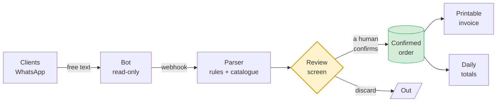
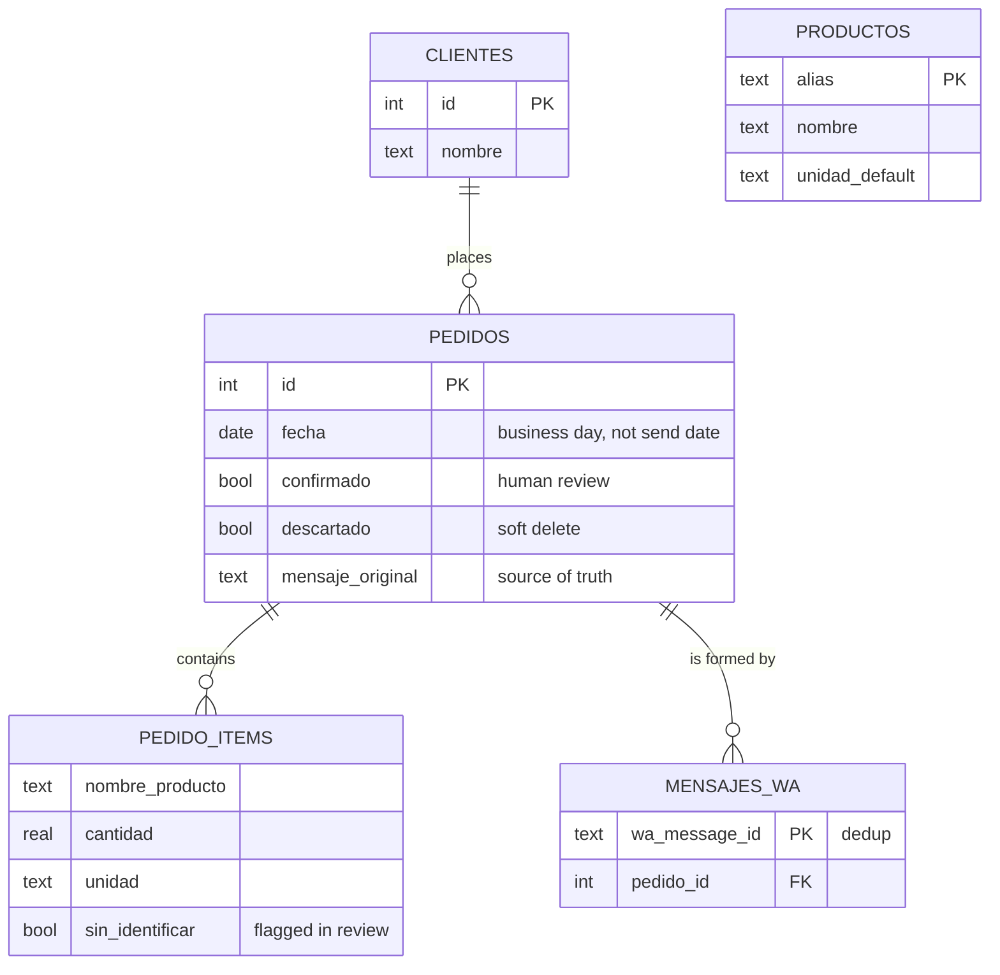

<div align="center">

# Pedidos Merca 🍅

### From 4 AM WhatsApp chaos… to an app running in production.

[🇪🇸 Español](README.md) · **🇬🇧 English**


</div>


> **This repository is a case study, not the code.** The app runs in production at a real business and its source is private. Here I cover **what I built, what broke, and what I learned**, with the snippets that best explain it.
> Recruiter and want to see the code? Message me and I'll grant read access to the private repo.

---

## 📋 In one line

A wholesale market stall in Gran Canaria received its orders as free-form WhatsApp messages and transcribed them **by hand, on paper, at 4 AM**. I built the system that digitises it end to end: capture bot, real-Spanish parser, human review, printable invoices and the day's sourcing list. **It's in daily use.**

## 🧩 The problem

Orders arrive like this, verbatim, through the afternoon and night:

```
Buenss noches para mañana
Piñas 4ud
Berros 1k
Calabasinos 4k
Una col pequeña
Tomate.
Lecjiga 4ud
Peras confer duras 10ud
```

(Typos, missing accents, local slang, quantities in every possible format — all real.)

And at 4 AM, someone has to turn **dozens** of those into:
- **one sheet per client** to prepare their order, and
- **a master list** of how much of each product to buy that morning.

It worked — through re-reading, transcription errors, and a lot of squinting at a phone before dawn.

## 🔄 How it works



**The golden rule: nothing counts without a human decision.** The parser proposes, the person disposes. This is a business where a mistake costs real money and produce that rots.

## 📸 The application

| Reviewing incoming orders | Printable client invoice |
|---|---|
|  |  |

| Daily sourcing totals | Upcoming-days agenda |
|---|---|
|  |  |

---

## 🐛 Three problems you don't see coming

The CRUD was the easy part. The interesting stuff showed up **after going to production**.

### 1️⃣ The parser has to survive real market Spanish

The catalogue speaks Canarian (*papa*, not *patata*; *millo*, *bubango*, *parchita*) and it's full of traps: **"piña de millo"** is corn, **"piña"** is pineapple, **"papa"** must never match **"papaya"**, and **"tomillo"** (thyme) isn't **"millo"** (corn).

The solution: **whole-word** matching with **longest-alias-wins**.

```js
function contienePalabra(textoNorm, alias) {
  // Escape metacharacters: aliases can come from user data.
  const escapado = alias.replace(/[.*+?^${}()|[\]\\]/g, '\\$&');
  return new RegExp('(^| )' + escapado + '( |$)').test(textoNorm);
}

function buscarEnCatalogo(textoNorm, extras) {
  let mejor = null;
  const fuentes = extras?.length ? catalogo.concat(extras) : catalogo;
  for (const entrada of fuentes) {
    for (const alias of entrada.alias) {
      if (alias && contienePalabra(textoNorm, alias)) {
        // "piña de millo" (13) beats "piña" (4): longest alias wins.
        if (!mejor || alias.length > mejor.alias.length) mejor = { entrada, alias };
      }
    }
  }
  return mejor;
}
```

**Then the real data arrived.** I dumped the actual orders that had already hit production, ran the parser over them, and measured what broke. Out came what no lab test predicts:

| What the client wrote | What the parser did | Why it mattered |
|---|---|---|
| `Berros 3k q estén bien` | Stored *"Q estén bien"* | 🔴 **The watercress vanished: never bought** |
| `Zanahoria 0,5kg` | `0 kg` + a junk line | 🔴 The decimal comma was used as a separator |
| `15 kilos de tomate grandes` | A line separate from *"Tomate"* | 🔴 Totals didn't add up: wrong purchase |
| `PEDIDO 15/07/26` | The date entered as a product | 🟠 Noise on every order from that client |
| ALL IN CAPS | Duplicate line in the totals | 🟠 One client always writes like that |

The first one was the serious one: if the number sits mid-line and there's a trailing remark, the parser kept the remark and **threw away the product**. It now looks for the product on **both sides** of the number:

```js
// The product may come AFTER the number ("3 kg tomato") or BEFORE
// ("Tomato 3k"), and there's often a trailing remark ("Watercress 3k make
// sure they're good"). Looking only at what follows would keep the remark
// and LOSE the product from the order.
const candidatos = [];
if (resto) candidatos.push(resto);
if (antes) candidatos.push(antes);

for (const cand of candidatos) {
  const limpio = limpiarNombre(cand);
  const hallado = buscarEnCatalogo(normProd(limpio), extras);
  if (hallado) { encontrado = hallado; base = limpio; break; }
}
```

> **Result of the *look at real data → fix → measure again* loop: recognition failures dropped 60% in a single pass** (28 → 11 on the same corpus; and of the remaining 11, almost none are even orders).

The delicate part was the criterion: you must strip *"large"*, *"good"*, *"make sure they're green"* so the totals add up… but **never** touch *"**white** watermelon"*, *"**green** melon"* or *"**fuji** apple"* — different goods, bought separately. No algorithm decides that: someone who understands the business does.

### 2️⃣ The QR that vanished on every deploy

Every update forced a fresh WhatsApp QR scan. The session was persisted on a volume, so it "shouldn't happen". And it didn't fail day to day: **only on restart**.

The docs didn't explain it. The library's source did:

```js
// wppconnect/src/controllers/browser.ts
browser = await puppeteer.launch({ headless, devtools, args, ...options.puppeteerOptions });

// Register an exit callback to remove user-data-dir
if (path.relative(os.tmpdir(), tmpUserDataDir).startsWith('puppeteer')) {
  process.on('exit', () => { rimraf.sync(tmpUserDataDir); });   // ⬅️ here
}
```

**Multi-device WhatsApp doesn't store the session in the "tokens" folder**: it stores it in the browser's IndexedDB — that is, **inside the Chromium profile**. With no explicit `userDataDir`, Puppeteer used a temporary profile… which the library deletes on exit. Container alive, session alive; container restarted, session gone.

The fix was one line. Finding it meant **not trusting the docs and reading the source**. And that same `if` proved the fix was safe: the library only deletes the profile when it lives under the system temp directory.

**But the story doesn't end there** — and this is the part that actually teaches something:

```
The profile appears to be in use by another Chromium process (113513)
on another computer (fcc13d82e21a). Chromium has locked the profile...
```

By persisting the profile, **Chromium's lock file started persisting too**. Every container boots with a different hostname, so Chromium saw "another computer" and refused to start. **I fixed one bug and introduced another.** The lesson: when you change a resource's lifecycle, you inherit *all* of its lifecycle, not just the part you wanted.

```js
// If we're starting up, nobody else is using the profile: the lock is
// leftover junk from the previous stop. Clear it (doesn't touch the session).
for (const f of ['SingletonLock', 'SingletonSocket', 'SingletonCookie']) {
  fs.rmSync(path.join(perfil, f), { force: true, recursive: true });
}
```

### 3️⃣ Orders don't arrive the way you design them

The *"one message = one order"* mental model breaks on day one. A client sends *"2 lettuces"*, five minutes later *"oh and 5 kg of potatoes"*, then *"thanks"*. That's **three cards to review and three invoices** for the same client.

Now messages from the same client for the same business day **merge into a single order** while it's still unreviewed: one card, one invoice, and the *"thanks"* gets absorbed on its own.

And if the order was already confirmed? Then new material comes in **separately, on purpose**: it may be printed or counted, and **a visible decision beats silently altering something someone already closed out**. That kind of call isn't made by code: it's made by whoever understands what happens at 4 AM if a sheet changes by itself.

That forced a data-model change (an order now has N messages) with an **automatic migration on startup** that backfills history without touching a single existing order.

---

## 🏗️ Architecture



Two design details that paid for themselves:

- **`mensaje_original` is always stored and never touched.** That's what let me re-interpret old orders with the improved parser *after the fact*. Storing raw input costs bytes; recovering it when you didn't costs the data.
- **Soft deletes everywhere** (`descartado`). In a real business, "I deleted it by mistake" happens. Undoing it is an `UPDATE`.

## ⚖️ Decisions (and why)

| Decision | Why | What I gave up |
|---|---|---|
| **No frameworks** (vanilla JS, 2 deps) | It has to run unattended for years. Every dependency is a time bomb on a 3-year horizon | Developer convenience |
| **SQLite** (built-in `node:sqlite`) | One user, a 1 GB VM. A Postgres here is one more server that can fall over | Concurrency I don't need |
| **Read-only bot** | Never replies, never sends. A bot that writes from the company's WhatsApp is a risk the business won't take | Automated confirmations |
| **Mandatory human review** | The parser is right a lot, but "a lot" isn't enough when you're buying perishable goods | Full automation |
| **Print-first** | The operator writes weights by hand on the sheet while packing. That part *should* stay on paper | "Modernising" for its own sake |
| **Container as root** ⚠️ | The opposite was attempted: under rootless Podman the UID mapping broke writes while reads kept working — a silent failure disguised as *"wrong password"*. Reverted deliberately and compensated: localhost-only port, `no-new-privileges`, private network with no internet exposure | Ideal isolation, in exchange for not having a false sense of security |

## 🔐 Security

Treated as a feature, and audited by **attacking, not reading**:

- **XSS**: real payloads injected (`` via client name and message text) → render as inert text. Verified in a real browser by confirming the live node **doesn't exist** in the DOM. Strict CSP as a second wall.
- **SQLi**: `1;DROP TABLE pedidos` bounces with a 404 and the tables are still there. Parameterised SQL everywhere, including the one dynamic statement (column whitelist).
- **Auth**: scrypt, constant-time comparisons, session regeneration on login, brute-force lockout, invalidation of all other sessions on password change.
- **ReDoS**: ruled out — 70,000 characters parsed in 9 ms.
- **Boundaries**: constant-time webhook token, validated timestamps, clamped quantities.

```js
// The webhook token is compared in constant time over digests, so that not
// even the token's length leaks information.
function tokenValido(recibido) {
  if (typeof recibido !== 'string' || !recibido) return false;
  const a = crypto.createHash('sha256').update(recibido).digest();
  const b = crypto.createHash('sha256').update(webhookToken).digest();
  return crypto.timingSafeEqual(a, b);
}
```

**One bug the audit caught** (and why you audit at all): mistyping your current password **kicked you out to the login screen**. The backend returned `401` ("not authenticated") for what was really a `403` ("authenticated, but that credential is wrong"), and the frontend — correctly — treats every `401` as an expired session. The right message was already written; it simply **never ran**.

## 🧪 Testing

The whole UI is regression-tested with **Playwright against a real browser**: login, message merging, review and confirm-with-date, discard, move-to-day, delete, invoices, printing, totals, agenda, settings, password rotation and logout. Plus parser tests over the real corpus (collisions, varieties, synonyms).

An uncomfortable lesson: **half the "failures" you find are your tests' fault.** I learned not to trust a red until I reproduce it by hand — three consecutive false positives (a modal the test never answered, a card that reorders when marked "ready", an API login that regenerated the session) would have had me "fixing" code that was perfectly fine.

## 📊 Numbers

| | |
|---|---|
| **Status** | In production, daily use |
| **Runtime dependencies** (web) | **2** (`express`, `express-session`) |
| **Size** | ~3,000 lines |
| **Hardware** | **1 GB RAM** VM |
| **Parser catalogue** | 100+ products with aliases and units |
| **Parser improvement from real data** | **−60%** recognition failures |
| **Vulnerabilities** (`npm audit`, web) | **0** |

## 🗂️ About the code

The source is **private**: it's commercial software for a real business. The snippets in this document are published as a work sample.

**Recruiter or tech lead and want to see it?** Message me and I'll grant read access to the private repo, or we can walk through it on a call. Happy to.

## 👤 Author

**José Carlos González Herrera** — developer (DAM) with a cybersecurity background, Gran Canaria 🇮🇨

[](https://github.com/JoseGlezHerrera)
[](mailto:jose.gonzalezh@protonmail.com)

---

<div align="center">
<sub>© 2026 José Carlos González Herrera. All rights reserved.<br/>
Code snippets are published as a work sample; no license to use is granted.</sub>
</div>
