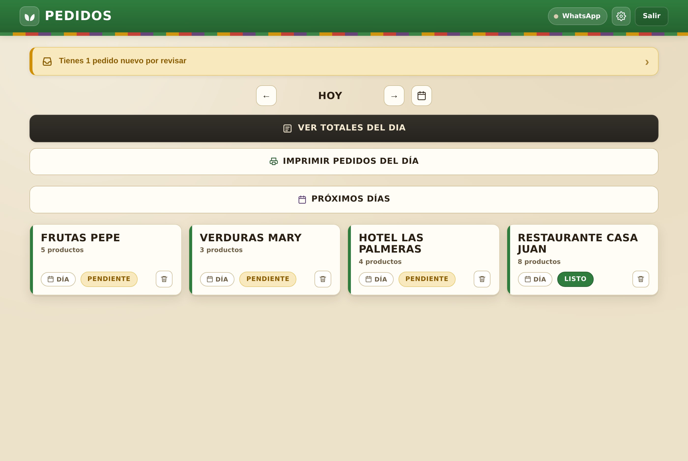
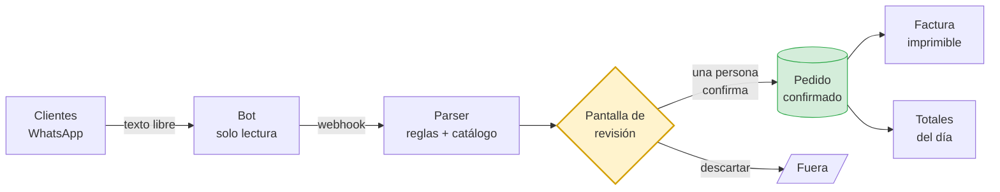
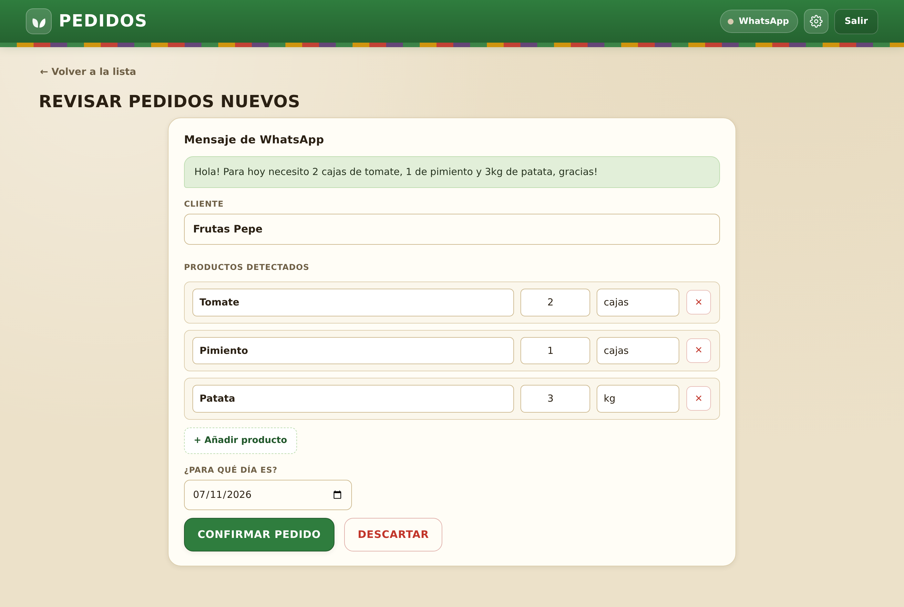
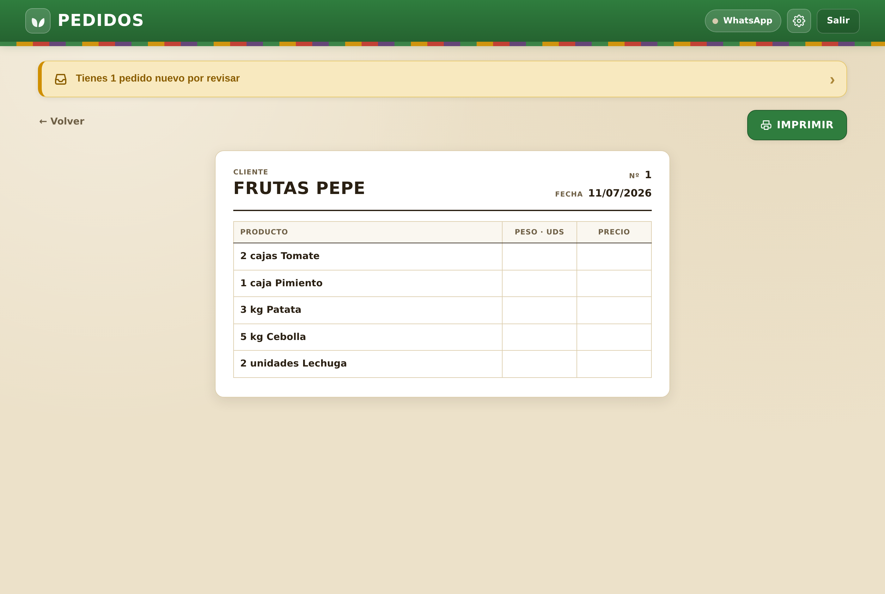
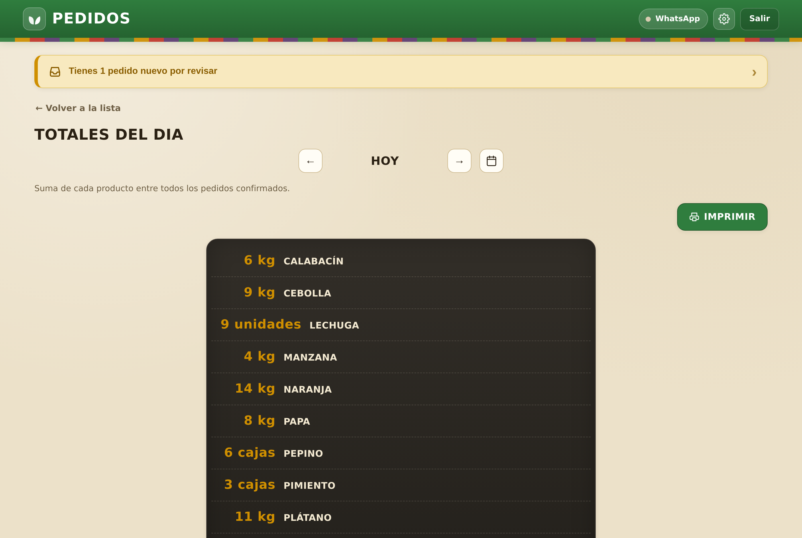
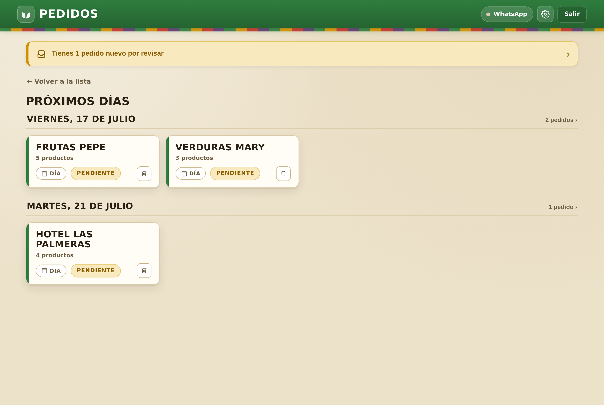
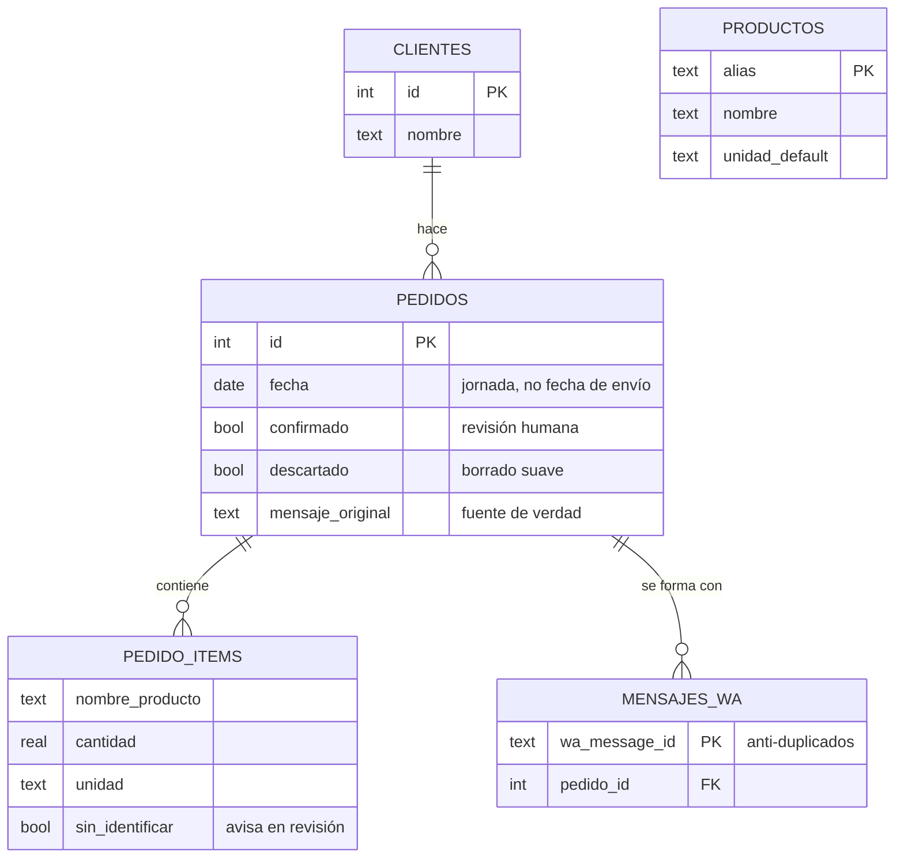

<div align="center">

# Pedidos Merca 🍅

### De un caos de mensajes de WhatsApp a las 4 de la madrugada… a una app en producción.

**🇪🇸 Español** · [🇬🇧 English](README.en.md)


</div>



> **Este repositorio es un caso de estudio, no el código.** La aplicación está en producción en un negocio real y su código es privado. Aquí cuento **qué construí, qué se rompió y qué aprendí**, con los fragmentos que mejor lo explican.
> ¿Eres recruiter y quieres ver el código? Escríbeme y te doy acceso de lectura al repositorio privado.

---

## 📋 En una línea

Un puesto del mercado mayorista de Gran Canaria recibía sus pedidos por WhatsApp en texto libre y los transcribía **a mano, en papel, a las 4 de la madrugada**. Construí el sistema que lo digitaliza de punta a punta: bot de captura, parser de español real, revisión humana, facturas imprimibles y lista de compra del día. **Está en uso diario.**

## 🧩 El problema

Los pedidos llegan así, tal cual, durante la tarde y la noche:

```
Buenss noches para mañana
Piñas 4ud
Berros 1k
Calabasinos 4k
Una col pequeña
Tomate.
Lecjiga 4ud
Peras confer duras 10ud
```

Y a las 4 AM, alguien tiene que convertir **decenas** de mensajes así en:
- **una hoja por cliente** para preparar su pedido, y
- **una lista maestra** con cuánto hay que traer de cada producto esa mañana.

Funcionaba — a base de releer, errores de transcripción y mucho entrecerrar los ojos frente al móvil de madrugada.

## 🔄 Cómo funciona



**La regla de oro: nada cuenta sin decisión humana.** El parser propone, la persona dispone. Es un negocio donde equivocarse cuesta dinero real y género que se pudre.

## 📸 La aplicación

| Revisión de pedidos entrantes | Factura imprimible por cliente |
|---|---|
|  |  |

| Totales del día para comprar | Agenda de próximos días |
|---|---|
|  |  |

---

## 🐛 Cuatro problemas que no se ven venir

Montar el CRUD fue lo fácil. Lo interesante apareció **después de ponerlo en producción**.

### 1️⃣ El parser tiene que sobrevivir al español de mercado real

El catálogo habla canario (*papa*, no *patata*; *millo*, *bubango*, *parchita*) y tiene trampas: **"piña de millo"** es maíz, **"piña"** es la tropical, **"papa"** no puede casar jamás con **"papaya"**, y **"tomillo"** no es **"millo"**.

La solución: emparejado por **palabra completa** con victoria del **alias más largo**.

```js
function contienePalabra(textoNorm, alias) {
  // Escapar metacaracteres: el alias puede venir de datos del usuario.
  const escapado = alias.replace(/[.*+?^${}()|[\]\\]/g, '\\$&');
  return new RegExp('(^| )' + escapado + '( |$)').test(textoNorm);
}

function buscarEnCatalogo(textoNorm, extras) {
  let mejor = null;
  const fuentes = extras?.length ? catalogo.concat(extras) : catalogo;
  for (const entrada of fuentes) {
    for (const alias of entrada.alias) {
      if (alias && contienePalabra(textoNorm, alias)) {
        // "piña de millo" (13) gana a "piña" (4): el alias más largo manda.
        if (!mejor || alias.length > mejor.alias.length) mejor = { entrada, alias };
      }
    }
  }
  return mejor;
}
```

**Y entonces llegaron los datos de verdad.** Volqué los pedidos reales que ya habían entrado en producción, pasé el parser por encima y medí qué fallaba. Apareció lo que ningún test de laboratorio predice:

| Lo que escribió el cliente | Lo que hacía el parser | Por qué importaba |
|---|---|---|
| `Berros 3k q estén bien` | Guardaba *"Q estén bien"* | 🔴 **Los berros desaparecían: no se compraban** |
| `Zanahoria 0,5kg` | `0 kg` + una línea basura | 🔴 La coma decimal se usaba como separador |
| `15 kilos de tomate grandes` | Línea aparte de *"Tomate"* | 🔴 Los totales no sumaban: se compraba mal |
| `PEDIDO 15/07/26` | La fecha entraba como producto | 🟠 Ruido en cada pedido de ese cliente |
| TODO EN MAYÚSCULAS | Línea duplicada en los totales | 🟠 Un cliente escribe siempre así |

El primero era el grave: si el número está en medio y hay una coletilla detrás, el parser se quedaba con la coletilla y **tiraba el producto**. Ahora busca el producto a **ambos lados** del número:

```js
// El producto puede ir DESPUÉS del número ("3 kg tomate") o ANTES
// ("Tomate 3k"), y muchas veces hay coletilla detrás ("Berros 3k q estén
// bien"). Si solo miráramos lo de después nos quedaríamos con la coletilla
// y PERDERÍAMOS el producto del pedido.
const candidatos = [];
if (resto) candidatos.push(resto);
if (antes) candidatos.push(antes);

for (const cand of candidatos) {
  const limpio = limpiarNombre(cand);
  const hallado = buscarEnCatalogo(normProd(limpio), extras);
  if (hallado) { encontrado = hallado; base = limpio; break; }
}
```

> **Resultado del ciclo *mirar datos reales → arreglar → volver a medir*: los fallos de reconocimiento bajaron un 60% de una tacada** (28 → 11 sobre el mismo corpus; y de los 11 restantes, casi ninguno es siquiera un pedido).

La parte delicada fue el criterio: hay que limpiar *"grandes"*, *"buenos"*, *"que estén verdes"* para que los totales sumen… pero **jamás** tocar *"sandía **blanca**"*, *"melón **verde**"* o *"manzana **fuji**"*, que son géneros distintos que se compran por separado. Eso no lo decide un algoritmo: lo decide alguien que entiende el negocio.

### 2️⃣ El QR que se perdía en cada despliegue

Cada actualización obligaba a reescanear el QR de WhatsApp. La sesión estaba persistida en un volumen, así que "no debería pasar". Y no fallaba en el día a día: **solo al reiniciar**.

La documentación no lo explicaba. El código fuente de la librería, sí:

```js
// wppconnect/src/controllers/browser.ts
browser = await puppeteer.launch({ headless, devtools, args, ...options.puppeteerOptions });

// Register an exit callback to remove user-data-dir
if (path.relative(os.tmpdir(), tmpUserDataDir).startsWith('puppeteer')) {
  process.on('exit', () => { rimraf.sync(tmpUserDataDir); });   // ⬅️ aquí
}
```

**El WhatsApp multidispositivo no guarda la sesión en la carpeta de "tokens"**: la guarda en el IndexedDB del navegador, o sea, **dentro del perfil de Chromium**. Sin un `userDataDir` propio, Puppeteer usaba un perfil temporal… que la librería borra al salir. Contenedor vivo, sesión viva; contenedor reiniciado, sesión a la basura.

El arreglo fue una línea. Encontrarlo exigió **dejar de creerse la documentación y leer el fuente**. Y ese mismo `if` demostraba que el arreglo era seguro: la librería solo borra el perfil si cuelga del directorio temporal del sistema.

**Pero la historia no acaba ahí** — y esta es la parte que de verdad enseña algo:

```
The profile appears to be in use by another Chromium process (113513)
on another computer (fcc13d82e21a). Chromium has locked the profile...
```

Al persistir el perfil, **el candado de Chromium también pasó a persistir**. Cada contenedor arranca con un hostname distinto, así que Chromium veía "otro ordenador" y se negaba a arrancar. **Arreglé un bug e introduje otro.** La lección: cuando cambias el ciclo de vida de un recurso, heredas *todo* su ciclo de vida, no solo la parte que te interesaba.

```js
// Si estamos arrancando, nadie más está usando el perfil: el candado es
// basura de la parada anterior. Se limpia (no toca la sesión).
for (const f of ['SingletonLock', 'SingletonSocket', 'SingletonCookie']) {
  fs.rmSync(path.join(perfil, f), { force: true, recursive: true });
}
```

### 3️⃣ Los pedidos no llegan como los diseñas

El modelo mental *"un mensaje = un pedido"* se rompe el primer día. Un cliente manda *"2 lechugas"*, a los cinco minutos *"y además 5 kg de papas"*, y luego *"gracias"*. Eso son **tres tarjetas que revisar y tres facturas** del mismo cliente.

Ahora los mensajes de un mismo cliente para una misma jornada se **fusionan en un único pedido** mientras esté sin revisar: una tarjeta, una factura, y los *"gracias"* se absorben solos.

¿Y si el pedido ya se confirmó? Entonces lo nuevo entra **aparte, a propósito**: puede estar impreso o contado, y **es mejor una decisión visible que modificar por detrás algo que alguien ya dio por cerrado**. Esa clase de decisión no la toma el código: la toma quien entiende qué pasa a las 4 de la mañana si una hoja cambia sola.

Eso obligó a un cambio de modelo de datos (un pedido pasa a tener N mensajes) con su **migración automática al arrancar**, que rellena el histórico sin tocar un solo pedido existente.

---

### 4️⃣ Los datos reales te dicen lo que el código no

Tres semanas después, en vez de leer código, volqué **91 pedidos reales y 391 líneas** de producción y comparé, línea a línea, lo que escribió el cliente contra lo que el parser extrajo.

Apareció esto:

```
Cliente: "Plátanos manillas"   ->  (nada)
Cliente: "Manzana roja"        ->  (nada)
Cliente: "Saco de cebolla"     ->  (nada)
```

Una línea que **nombraba un producto pero no decía cuánto** se descartaba entera. Sin marcarla, sin avisar, sin dejar rastro. Y hay clientes que piden justo así, porque dan por hecho que el vendedor ya sabe cuántas manillas ponerles.

El daño en tres semanas: **14 líneas perdidas**. Un mismo cliente pidió plátanos **cuatro veces** sin que se le compraran nunca. Y uno de esos pedidos llegó a **confirmarse e imprimirse** sin el producto — nadie lo notó, porque en la pantalla de revisión no aparecía.

Ninguna prueba lo habría cazado: el sistema hacía exactamente lo que decía su código. La regla *"si no hay número, no es un pedido"* es perfectamente razonable en un despacho, y perfectamente falsa en un mercado.

Ahora esa línea entra **marcada en rojo** con cantidad 0 y un aviso — *"El cliente lo pidió sin decir cuánto: pon la cantidad o quítalo"* — para que lo resuelva una persona. **Si el sistema no sabe algo, lo dice; no decide por su cuenta que no existe.**

De 14 líneas perdidas a 0. Y por el camino salieron cuatro cosas más: medio kilo que se perdía en *"1k y medio"*, los recados entre paréntesis rompiendo los totales, y unidades que solo existen en un mercado (*sacos*, *manillas*, *tarrinas*).

---

## 🏗️ Arquitectura



Dos detalles de diseño que pagaron solos:

- **`mensaje_original` se guarda siempre y nunca se toca.** Gracias a eso pude re-interpretar pedidos antiguos con el parser nuevo *a posteriori*. Guardar la entrada cruda cuesta bytes; recuperarla cuando no la guardaste cuesta el dato.
- **Borrado suave en todas partes** (`descartado`). En un negocio, "lo he borrado sin querer" pasa. Recuperarlo es un `UPDATE`.

## ⚖️ Decisiones (y por qué)

| Decisión | Por qué | Qué renuncié |
|---|---|---|
| **Sin frameworks** (JS vanilla, 2 dependencias) | Tiene que funcionar sin mantenimiento durante años. Cada dependencia es una bomba de relojería a 3 años vista | Comodidad de desarrollo |
| **SQLite** (`node:sqlite` integrado) | Un solo usuario, una VM de 1 GB. Un Postgres aquí es un servidor más que puede caerse | Concurrencia que no necesito |
| **Bot de solo lectura** | Nunca responde, nunca envía. Un bot que escribe en el WhatsApp de la empresa es un riesgo que el negocio no acepta | Automatizar confirmaciones |
| **Revisión humana obligatoria** | El parser acierta mucho, pero "mucho" no es suficiente cuando compras género perecedero | Automatización total |
| **Print-first** | El operario apunta pesos a mano sobre el papel mientras prepara. Esa parte *debe* seguir en papel | "Modernizar" por modernizar |
| **Contenedor como root** ⚠️ | Se intentó lo contrario: bajo Podman rootless el mapeo de UID rompía las escrituras mientras las lecturas funcionaban — un fallo silencioso disfrazado de *"contraseña incorrecta"*. Revertido conscientemente y compensado: puerto solo en localhost, `no-new-privileges` y sin puertos abiertos al exterior | Aislamiento ideal, a cambio de no tener una falsa sensación de seguridad |
| **Acceso público por túnel, no abriendo puertos** | Nació como servicio de red privada: para entrar había que estar en la VPN. Cuando los usuarios pidieron consultar los pedidos desde el móvil, la opción cómoda era abrir el 443 y poner un dominio propio. Se eligió lo contrario: un túnel inverso que publica el servicio **sin abrir un solo puerto en la máquina** y sin exponer su IP. Y antes de encender nada, contraseña larga | Un dominio bonito. La URL es fea, pero se instala como app en el móvil y no se escribe nunca |

## 🔐 Seguridad

Se trató como una funcionalidad, y se auditó **atacando, no leyendo**:

- **XSS**: inyectados payloads reales (`` vía nombre de cliente y texto de mensaje) → renderizan como texto inerte. Verificado en un navegador real comprobando que el nodo vivo **no existe** en el DOM. CSP estricta como segunda muralla.
- **SQLi**: `1;DROP TABLE pedidos` rebota con un 404 y las tablas siguen ahí. SQL parametrizado en todas partes, incluida la única sentencia dinámica (lista blanca de columnas).
- **Auth**: scrypt, comparaciones en tiempo constante, regeneración de sesión al entrar, bloqueo anti-fuerza-bruta, invalidación del resto de sesiones al cambiar la contraseña.
- **ReDoS**: encontrado y corregido. La historia, abajo.
- **Fronteras**: token del webhook comparado en tiempo constante, timestamps validados, cantidades acotadas.

```js
// El token del webhook se compara en tiempo constante y sobre digests, para
// que ni la longitud del token filtre información.
function tokenValido(recibido) {
  if (typeof recibido !== 'string' || !recibido) return false;
  const a = crypto.createHash('sha256').update(recibido).digest();
  const b = crypto.createHash('sha256').update(webhookToken).digest();
  return crypto.timingSafeEqual(a, b);
}
```

**El fallo que introdujo el arreglo anterior.** Una versión previa de este documento afirmaba, con una medición detrás: *"ReDoS descartado — 70.000 caracteres parseados en 9 ms"*. Era cierto **cuando se midió**.

Un mes después añadí un patrón para entender *"1k y medio"*, y una auditoría posterior lo desmontó:

```js
// Este patrón parece inofensivo. No lo es.
/(\d+)\s*(k|kg|kilos?|cajas?|unidades?|uds?)?\s+y\s+medi[oa]\b/i
```

Ante un número largo **sin** *"y medio"* detrás, el motor prueba a casar desde cada dígito y recorre el resto en cada intento: **tiempo cuadrático**. Un mensaje con 30.000 dígitos — que un cliente puede enviar por WhatsApp — bloqueaba el servidor **7 segundos**. Y Node es de un solo hilo: durante ese rato, la app no atiende a nadie.

El arreglo es un carácter: `\d+` → `\d{1,6}`. **7003 ms → 13 ms**, sin perder ninguna cantidad real.

Dos lecciones, y la segunda duele más que la primera. Una: **un parche que resuelve un caso puede abrir otro peor**. Otra: aquella medición de 9 ms no era mentira, era **una garantía con fecha de caducidad** sobre un código que ya no existía. Las afirmaciones de seguridad hay que volver a medirlas, no recordarlas.

En la misma pasada aparecieron una cantidad `Infinity` que se guardaba en la base de datos y envenenaba los totales del día, y nueve puntos donde un tipo inesperado tumbaba un endpoint. Nada de eso permitía leer datos ajenos — pero *"no es explotable"* no es lo mismo que *"está bien"*.

**Un bug que encontró la auditoría** (y que ilustra por qué se audita): equivocarse al escribir tu contraseña actual **te echaba a la pantalla de login**. El backend devolvía `401` ("no autenticado") para un caso que en realidad era `403` ("autenticado, pero esa credencial no vale"), y el frontend — correctamente — trata todo `401` como sesión caducada. El aviso correcto ya estaba escrito; simplemente **nunca llegaba a ejecutarse**.

## 🧪 Testing

La interfaz completa se somete a regresión con **Playwright contra un navegador real**: login, fusión de mensajes, revisión y confirmación con fecha, descartar, mover de día, eliminar, facturas, impresión, totales, agenda, ajustes, rotación de contraseña y cierre de sesión. Más pruebas de parser sobre el corpus real (colisiones, variedades, sinónimos).

Un aprendizaje incómodo: **la mitad de los "fallos" que encuentras son de tus tests.** Aprendí a no fiarme de un rojo hasta reproducirlo a mano — tres falsos positivos seguidos (un modal que el test no respondía, una tarjeta que se reordena al marcarse "lista", un login por API que regeneraba la sesión) me habrían hecho "arreglar" código que estaba perfecto.

## 📊 Números

| | |
|---|---|
| **Estado** | En producción, uso diario |
| **Dependencias en runtime** (web) | **2** (`express`, `express-session`) |
| **Tamaño** | ~3.000 líneas |
| **Hardware** | VM de **1 GB de RAM** |
| **Catálogo del parser** | +100 productos con alias y unidades |
| **Mejora del parser con datos reales** | **−60%** de fallos de reconocimiento |
| **Auditoría sobre datos de producción** | 91 pedidos · 391 líneas · **14 pedidos perdidos → 0** |
| **Vulnerabilidades** (`npm audit`, web) | **0** |

## 🗂️ Sobre el código

El código fuente es **privado**: es software comercial para un negocio real. Los fragmentos de este documento se publican como muestra de trabajo.

**¿Eres recruiter o tech lead y quieres verlo?** Escríbeme y te doy acceso de lectura al repositorio privado, o lo repasamos juntos en una llamada. Encantado.

## 👤 Autor

**José Carlos González Herrera** — desarrollador (DAM) con base en ciberseguridad, Gran Canaria 🇮🇨

[](https://github.com/JoseGlezHerrera)
[](mailto:jose.gonzalezh@protonmail.com)

---

<div align="center">
<sub>© 2026 José Carlos González Herrera. Todos los derechos reservados.<br/>
Los fragmentos de código se publican como muestra de trabajo; no se concede licencia de uso.</sub>
</div>
